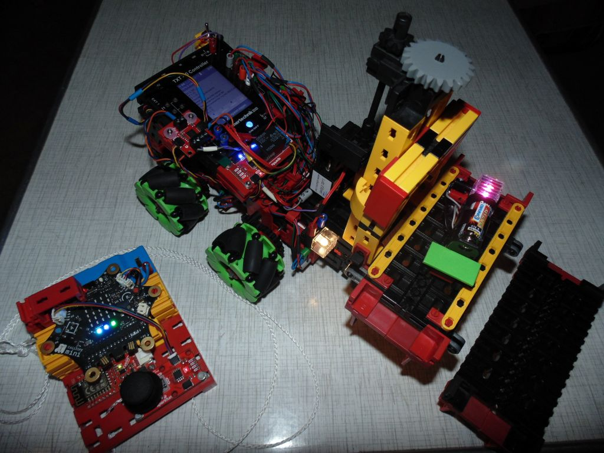

[Calliope WLAN Fernbedienung](https://elssner.github.io/MQTT-Fernbedienung-Gabelstapler/) | [MQTT Kommandos für Gabelstapler](https://elssner.github.io/MQTT-Fernbedienung-Gabelstapler/mqtt/)

## MQTT Kommandos für Gabelstapler

* fischertechnik ROBO Pro Coding Projekt: [MQTT_Gabelstapler](https://git.fischertechnik-cloud.com/calliope/MQTT_Gabelstapler)

MQTT erfordert eine WLAN Verbindung mit IP Adressen zwischen Sender und Empfänger. Der TXT 4.0 Controller auf dem Modell ist WLAN Access Point und mit Python wird im Linux eine eigene mosquitto Instanz an Port 1884 gestartet.
Mit diesem MQTT Broker verbindet sich lokal das ROBO Pro Coding Projekt als MQTT Subscriber. Als Daten existiert nur ein einziger String, der in der dauerhaft Schleife ständig abgefragt wird.
Der TXT 4.0 Controller auf dem Modell ist nur Subscriber und sendet keine Daten.

### Fernbedienung Sender

Als MQTT Publisher ist ein **zweiter TXT 4.0 Controller** geeignet:
* fischertechnik ROBO Pro Coding Projekt: [MQTT_Fernbedienung_Joystick](https://git.fischertechnik-cloud.com/calliope/MQTT_Fernbedienung_Joystick)

**Calliope** kann mit [Cytron WLAN Modul](../doc) ebenfalls als MQTT Publisher den Daten String an den TXT 4.0 Controller senden. 
* Calliope v3 [MakeCode](https://makecode.calliope.cc/) Projekt: [MQTT-Fernbedienung-Gabelstapler](https://github.com/elssner/MQTT-Fernbedienung-Gabelstapler)

Für die Steuerung von Omniwheels in alle Richtungen bietet sich der auf dem Calliope integrierte Gestensensor an.
Nur durch Neigen des Calliope kann das Modell ferngesteuert werden. Allerdings ist Kurven fahren schwierig, wenn alle Motoren mit der gleichen Geschwindigkeit synchronisiert sind (und sich nur in verschiedene Richtungen oder gar nicht drehen).

Ein I²C Joystick lässt sich auch einfach an Calliope stecken. Zum Fahren und Lenken ohne Servo bietet sich die Raupensteuerung an. Dazu werden die Räder vorn und hinten synchronisiert (wie bei einer Kette). 
Bei der Joystick Steuerung werden zwei Geschwindigkeiten für links und rechts übertragen.

### MQTT Protokoll

Calliope sendet an das WLAN Modul seriell (RX/TX) AT Kommandos wie bei einem Modem.\
Die MQTT AT Kommandos existieren nur auf dem Cytron Modul. 
> `AT+MQTTPUB=0,"topic","3;j;128;128",1,0`

Der Daten-String `"3;j;128;128"` ist mit Semikolon CSV kodiert.\
Beispiele: `1;stop` `2;q;128` `3;r;1` `4;m;-512;512` `5;j;0;255` `6;bt_fw;512`

Der MQTT Subscriber (TXT 4.0 Python Code Blöcke) teilt den Daten-String in eine Liste von Strings.\
`['3', 'j', '128', '128']` Das erste Element ist eine laufende Nummer. Jede Nummer wird nur einmal verarbeitet.
Nur bei Änderung des Zähles wird eine Aktion bei den Motoren (und Relais) ausgelöst.

Folgende Daten-Strings werden vom Modell **MQTT Gabelstapler** verstanden:

* Länge >= 2 und [1] = "stop"\
  *Encodermotoren und I²C Qwiic Motoren stoppen* 
  * [0] Zähler
  * [1] = "stop"
* Länge >= 3 und [1] = "q"\
  *Motoren über I²C steuern* [SparkFun Qwiic Motor Driver](https://www.sparkfun.com/products/15451)
  * [0] Zähler
  * [1] = "q"
  * [2] = Qwiic Motor A: (0 .. 128 .. 255) 128 ist STOP
  * optional [3] = Qwiic Motor B: (0 .. 128 .. 255)
  * optional [4] = Qwiic Motor C: (0 .. 128 .. 255)
  * optional [5] = Qwiic Motor D: (0 .. 128 .. 255)
* Länge >= 3 und [1] = "r"\
  *Licht mit I²C Relais schalten* [SparkFun Qwiic Single Relay](https://www.sparkfun.com/products/15093)
  * [0] Zähler
  * [1] = "r"
  * [2} = "1" schaltet Relais an, alles andere schaltet aus
* Länge = 4 und [1] = "m"\
  *direkte Motor Geschwindigkeit Werte (Räder vorn und hinten synchronisiert)*
  * [0] Zähler
  * [1] = "m"
  * [2] = motor_links (-512 .. 0 .. +512)
  * [3] = motor_rechts (-512 .. 0 .. +512)
* Länge = 4 und [1] = "j"\
  *direkte Joystick x/y Werte (Raupensteuerung beim Empfänger)*
  * [0] Zähler
  * [1] = "j"
  * [2] = j_fahren (0 .. 128 .. 255)
  * [3] = j_lenken (0 .. 128 .. 255)
* Länge = 3\
  *Omniwheels mit Calliope Gestensensor steuern*\
  *oder mit Buttons auf dem TXT 4.0 Touch Display*
  * [0] Zähler
  * [1] button_id ("bt_..") = 11 Buttons bzw. Gesten\
    *Omniwheels 8 Richtungen gerade, 2 drehen auf der Stelle, Stop*
    * "bt_0", "bt_stop" (stoppe 4 Motoren sync)
    * ↑ ↓ "bt_fw", "bt_bw" (vorwärts, rückwaärts)
    * ← → "bt_left", "bt_right" (gerade nach links, rechts)
    * ↖ ↗ ↙ ↘ "bt_fw_left", "bt_fw_right", "bt_bw_left", "bt_bw_right"
    * ↶ ↷ "bt_turn_left", "bt_turn_right" (auf der Stelle drehen)
    * sonst (stoppe 4 Motoren sync)
  * [2] speed (0 .. +512)
* sonst\
  *alle Motoren stoppen und "payload {} ungültig" anzeigen*

