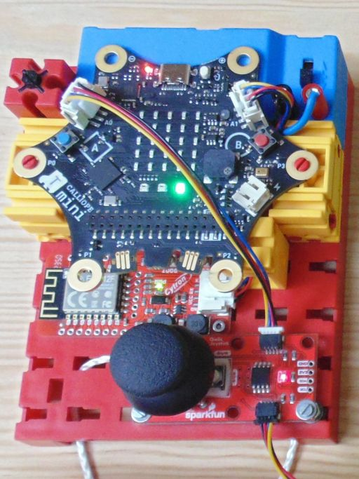

Diese Seite bei [https://elssner.github.io/MQTT-Fernbedienung-Gabelstapler/](https://elssner.github.io/MQTT-Fernbedienung-Gabelstapler/) öffnen

## Calliope WLAN Fernbedienung (MQTT / IoT)

* Calliope v3 Projekt laden: [elssner/MQTT-Fernbedienung](https://elssner.github.io/MQTT-Fernbedienung/)
* WLAN Modul: [Cytron: Grove WiFi 8266 - IoT for micro:bit and beyond](doc/)
* Andere 8266 oder 8285 Module sind nicht geeignet.
* I²C Qwiic Joystick und LCD Display (Qwiic oder Grove) sind optional.

LED Status|`a`|`b`|`c`
---|---|---|---
beim Verbinden|serielle Schnittstelle|WLAN Verbindung|MQTT Verbindung
beim Fernsteuern|Gesten (Calliope neigen)|Joystick|MQTT Verbindung

#### LED `a` `b` `c` Farben
* `weiß` Ereignis gestartet (Knopf loslassen)
* `grün` bei OK nach einem AT-Kommando
* `rot` bei Fehler nach einem AT-Kommando
* `orange` Warnung, warten
* `blau` Fernsteuerung bereit, Daten werden gesendet (Publish)
* `gelb` Verbindung getrennt (mit Knopf B)

### `a` beim Start
* `a weiß` serielle Schnittstelle wird initialisiert
* `a orange` 2 Sekunden warten auf Stromversorgung
* LCD Display erkennen und initialisieren
* `b orange` wenn kein Display erkannt
* AT+RST (Reset WLAN Modul)
* `a grün` bei Erfolg `a rot` bei Fehler
* Anzeige der AT Response auf LCD Display

Jetzt sollte `a grün` leuchten und - wenn kein Display angeschlossen ist - `b orange`.

### `b` Kopf B geklickt
* WLAN verbinden <ins>wenn MQTT nicht verbunden</ins>
  * `b weiß` wenn Kopf B geklickt
  * WLAN verbinden (SSID und Password)
  * `b grün` bei Erfolg `b rot` bei Fehler
* MQTT trennen <ins>wenn MQTT verbunden</ins>
  * MQTT Publish: STOP zum Modell senden
  * `a aus` bei Erfolg `a rot` bei Fehler
  * `b aus`
  * <ins>MQTT trennen</ins>
  * `c gelb` bei Erfolg `c rot` bei Fehler
* Anzeige der AT Response auf LCD Display

Jetzt sollte beim Verbinden `a grün` und `b grün` leuchten.
Nach dem Trennen nur `c gelb`.

### `c` Kopf B halten
* `c weiß` Kopf B erkannt, loslassen
* MQTT Client vorbereiten (ID, Username, Password)
  * <ins>MQTT trennen</ins> bei Fehler
  * `c gelb` bei Erfolg `c rot` bei Fehler
* `c orange` bei Erfolg
* Anzeige der AT Response auf LCD Display
* MQTT Client verbinden (IP Adresse, Port)
  * `c rot` bei Fehler
* `c grün` <ins>MQTT ist verbunden</ins>
* `a blau` wenn Gesten aktiviert
* `b blau` wenn Joystick angeschlossen
* Variablen initialisieren
* Anzeige der AT Response auf LCD Display

`c grün` zeigt an, dass MQTT verbunden und die Fernbedienung bereit ist.\
`b blinkt blau`, wenn die Daten vom Joystick gesendet werden.\
`a blau`, wenn die Gesten gesendet werden (muss noch aktiviert werden).

> Gesten funktionieren nur, wenn kein LCD Display angeschlossen ist.

### Kopf A geklickt
* wenn Display angeschlossen
  * die letzten 10 Response Strings im LCD Display anzeigen
  * mit jedem Klick auf A wird weiter geschaltet (nur vorwärts)
* wenn kein Display angeschlossen und <ins>MQTT verbunden</ins>
  * Gesten abwechselnd an und aus schalten
  * Gesten an
    * `a lila` Geschwindigkeit beim Neigen langsamer
    * `a blau` Geschwindigkeit beim Neigen max (512)
  * Gesten aus
    * MQTT Publish: STOP zum Modell senden
    * `a aus` bei Erfolg `a rot` bei Fehler

### Kopf A halten
* wenn Display angeschlossen
  * AT+MQTTCONN? MQTT Status abrufen und anzeigen
* wenn kein Display angeschlossen
  * den letzten Response String im Calliope Display anzeigen

### Kopf A+B geklickt
* zur Zeit nicht verwendet

### Joystick
* `b blinkt blau`
* Fahren und Lenken nach dem Prinzip Raupensteuerung.
* Die linken Räder und die rechten Räder sind jeweils synchronisiert.
* Joystick nach rechts oder links: Drehen auf der Stelle.
* Joystick Button schaltet das I²C Relais und das Licht am Modell.

### Gesten (Calliope neigen, kippen, drehen)
* `a blau` bei Stop, `a lila` beim Neigen
* `a rot` bei MQTT Publish Fehler
* wenn Logo nach unten
* wenn Logo nach oben
* wenn nach links neigen
* wenn nach rechts neigen
* wenn Display nach unten
* wenn Display nach oben

↶| |↷
---|---|---
↖|↑|↗
←|↯|→
↙|↓|↘

Modell fährt in die entsprechende Richtung. Die Tabelle zeigt alle möglichen Richtungen (8 gerade, 2 auf der Stelle drehen und Stop).
Dabei werden teilweise zwei aufeinander folgende Gesten ausgewertet (erst links/rechts neigen, dann vor/zurück oder nach unten drehen).
